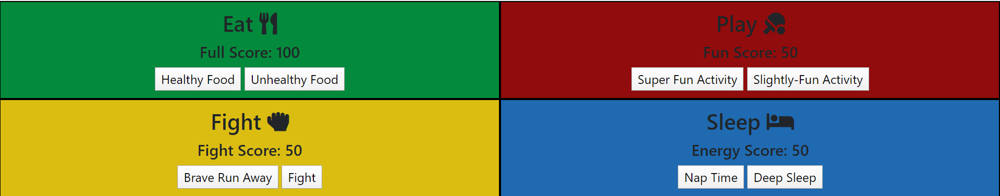

# Tamagotchi
## Description
This project allows users to interact with the 90s favorite pocket pet, the Tamagotchi.  There are four different activities to do when interacting including giving the Tamagotchi food, fighting, sleeping, and playing.  Depending on the type of activity the users chooses to do, the tamagotchi's score will decrease or increase.
## Screenshots
;
## How To Run
1. Clone down this repo
1. Make sure you have  http-serve installed via npm. If not, get it [HERE](https://npmjs.com/package/http-server).
1. On your command line run `hs -p 9999`
1. In your browser go to `http://localhost:9999`
